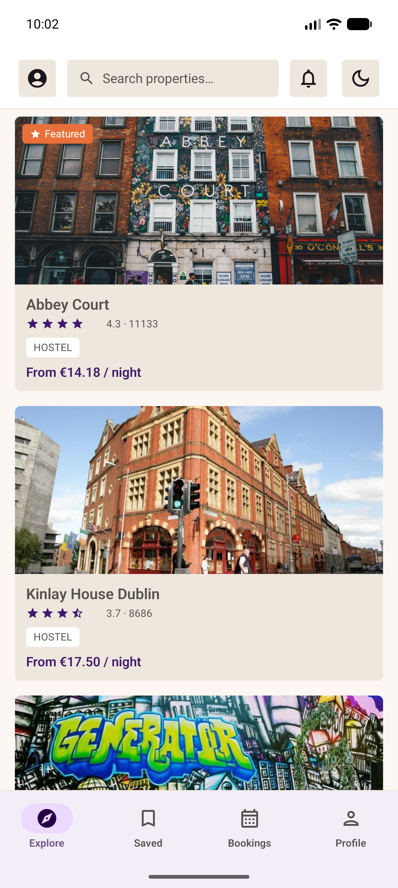
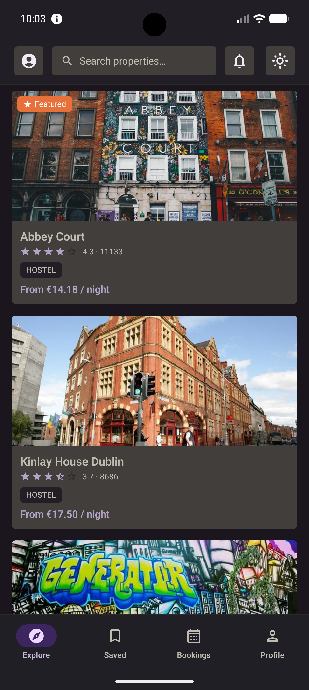
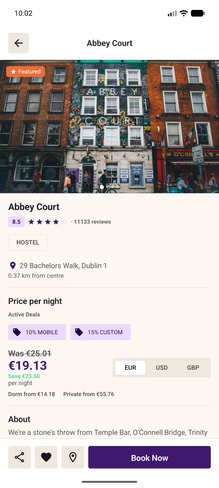
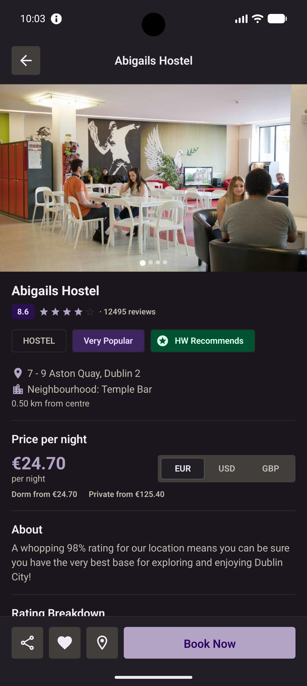
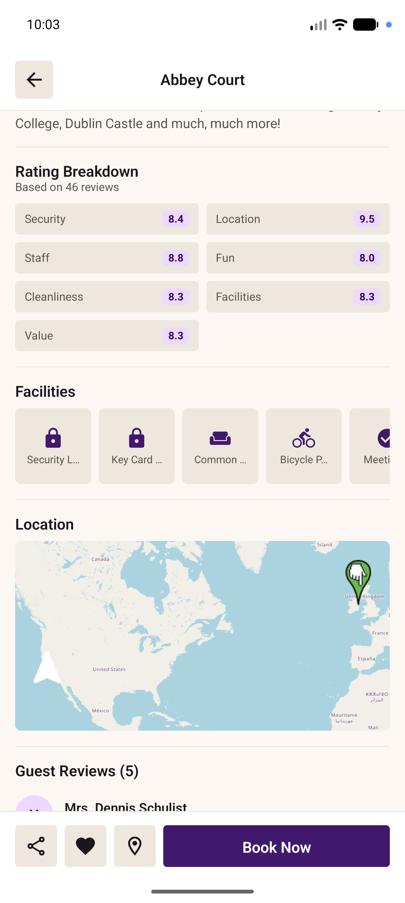
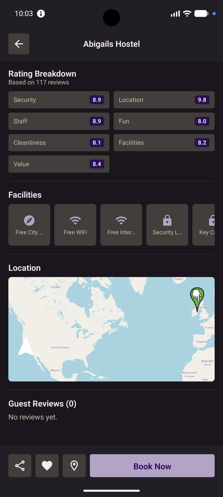
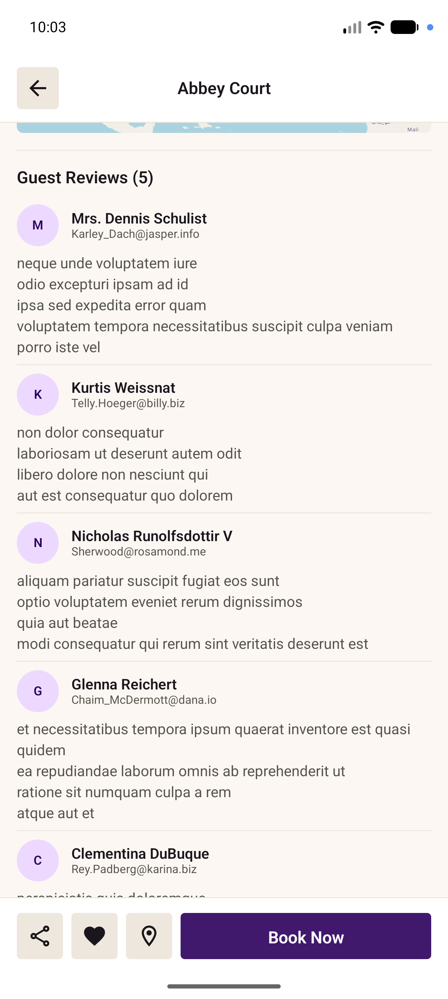
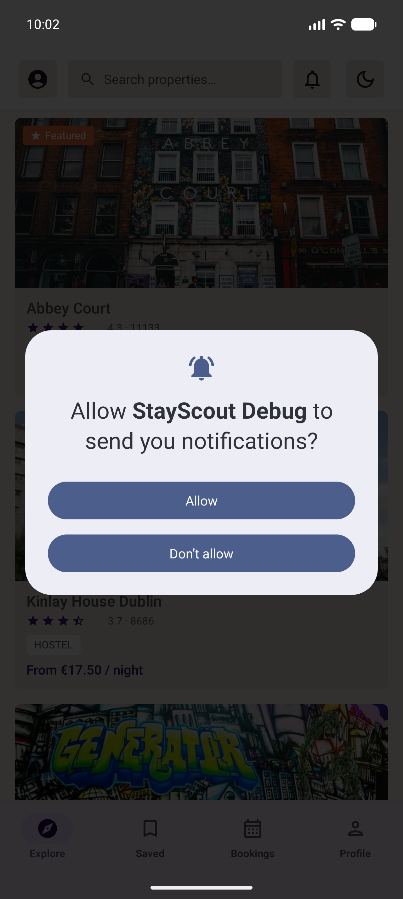
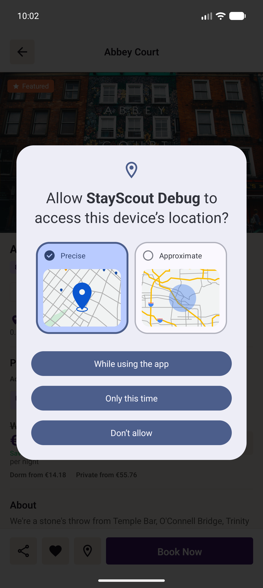

# StayScout

An Android app for browsing and exploring hostel and property listings, built with Clean Architecture + MVI. It fetches properties from a remote API, caches them locally for offline use, displays live exchange rates, and lets users explore property details with multi-currency pricing, interactive maps, and guest reviews.

---

## Table of Contents

- [Screenshots](#screenshots)
- [Tech Stack](#tech-stack)
- [Architecture](#architecture)
- [Module Map](#module-map)
- [Project Setup](#project-setup)
- [Running the App](#running-the-app)
- [Developer Onboarding](#developer-onboarding)
- [Quality Gates](#quality-gates)
- [Production Readiness](#production-readiness)
- [Implementation Status](#implementation-status)
- [Planned Features](#planned-features)

---

## Screenshots

### Explore

| Light | Dark |
|:---:|:---:|
|  |  |

### Property Detail

| Top — Light | Top — Dark |
|:---:|:---:|
|  |  |

| Bottom — Light | Bottom — Dark |
|:---:|:---:|
|  |  |

### Guest Reviews & Loading

| Guest Reviews | Detail Skeleton |
|:---:|:---:|
|  |  |

### Permission Flows

| Notifications | Location |
|:---:|:---:|
|  |  |

---

## Tech Stack

| Area | Library / Tool | Version |
|---|---|---|
| Language | Kotlin | 2.3.21 |
| UI | Jetpack Compose + Material 3 | BOM 2026.02.01 |
| DI | Hilt | 2.59.2 |
| Navigation | Navigation Compose (type-safe) | 2.9.8 |
| Networking | Retrofit + OkHttp | 2.11.0 / 4.12.0 |
| Serialization | kotlinx-serialization-json | 1.7.3 |
| Image loading | Coil | 2.7.0 |
| Local database | Room + SQLCipher | 2.7.1 / 4.5.4 |
| Theme persistence | DataStore Preferences | 1.1.1 |
| Maps | OSMDroid | 6.1.18 |
| Crash reporting | Firebase Crashlytics | BOM 33.15.0 |
| Analytics | Firebase Analytics | BOM 33.15.0 |
| Async | Kotlin Coroutines + Flow | 1.9.0 |
| HTTP inspector | Chucker (debug / QA only) | 4.1.0 |
| Code generation | KSP | 2.3.9 |
| Java 8+ APIs on API 24 | Core Library Desugaring | 2.1.4 |
| Linting | ktlint + Compose Rules | 1.5.0 / 0.6.0 |
| Static analysis | detekt | 2.0.0-alpha.3 |
| Code coverage | Kover | 0.9.8 |
| Component browser | Showkase | 1.0.4 |
| Testing | JUnit 4 + MockK + Coroutines Test | — |
| CI/CD | GitHub Actions | — |

---

## Architecture

StayScout uses **Clean Architecture** split across four Gradle modules, combined with the **MVI (Model-View-Intent)** pattern in the presentation layer.

```
┌────────────────────────────────────────────────────────────┐
│                          :app                              │
│  Entry point · Hilt setup · Navigation graph               │
│  App Links deep links · Initializers                       │
└───────────────────────┬────────────────────────────────────┘
                        │ depends on
          ┌─────────────┴──────────────┐
          ▼                            ▼
┌──────────────────┐      ┌───────────────────────────┐
│ :stayout-data    │      │  :stayout-presentation    │
│                  │      │                           │
│ Retrofit APIs    │      │  Compose screens          │
│ Room DAOs/DB     │      │  MVI ViewModels           │
│ Repository impls │      │  UI components            │
│ Remote mappers   │      │  Presentation mappers     │
│ Local mappers    │      │  UI models                │
│ Firebase repos   │      │  Shimmer skeletons        │
└────────┬─────────┘      └──────────┬────────────────┘
         │                           │
         └──────────┬────────────────┘
                    │ depends on
                    ▼
          ┌──────────────────────┐
          │   :stayout-domain    │
          │                      │
          │  Domain models       │
          │  Repository interfaces│
          │  Use cases (abstract)│
          └──────────────────────┘
```

### MVI pattern

Every screen follows a strict three-file MVI contract:

```
HomeState.kt    ← sealed interface (Initializing | Ready)
HomeIntent.kt   ← sealed interface (user actions)
HomeEvent.kt    ← sealed interface (one-shot side effects)
```

`BaseViewModel<State, Intent, Event>` wires them together. ViewModels expose:
- `state: StateFlow<State>` — collected in Composables via `collectAsStateWithLifecycle`
- `events: Flow<Event>` — one-shot events collected in `LaunchedEffect`
- `onIntent(intent)` — single entry point for all user interactions

### Data flow

```
UI Intent
   │
   ▼
ViewModel.onIntent()
   │
   ▼
UseCase (suspend / Flow)
   │
   ▼
Repository (interface in :domain, impl in :data)
   │
   ├── Remote (Retrofit API)  ─┐
   └── Local  (Room DAO)      ─┴── mapper → domain model → state update
```

### Offline-first caching

Both `PropertyRepositoryImpl` and `RatesRepositoryImpl` attempt the network first, persist the response to Room (encrypted with SQLCipher), and fall back to the cached data on failure. The app is fully usable without a connection if it has been opened at least once online.

### Network status

`NetworkStatusRepositoryImpl` wraps `ConnectivityManager.NetworkCallback` in a `callbackFlow`. `ObserveNetworkStatusUseCase` exposes this as a `Flow<Boolean>`. ViewModels subscribe to it on init, driving the `OfflineBanner` and a "back online" snackbar.

---

## Module Map

```
StayScout/
├── app/                            # :app module
│   └── src/main/
│       ├── MainActivity.kt         # Single Activity, theme state holder
│       ├── StayScoutApplication.kt # Hilt entry point; installs initializers
│       ├── di/AppModule.kt         # App-level Hilt bindings (IsDebug, URLs)
│       ├── initializer/            # DebugInitializer, OsmDroidInitializer, CrashlyticsInitializer
│       └── navigation/AppNavGraph.kt # Type-safe nav host with deep link wiring
│
├── stayout-domain/                 # :stayout-domain module (pure Kotlin)
│   └── src/main/java/.../domain/
│       ├── model/                  # Domain models (PropertyDomainModel, AnalyticsEvent, …)
│       ├── repository/             # Repository interfaces including AnalyticsRepository
│       └── usecase/                # Abstract use cases + base classes
│
├── stayout-data/                   # :stayout-data module
│   └── src/main/java/.../data/
│       ├── di/                     # Hilt modules (Network, Database, Mapper, Repository)
│       ├── local/
│       │   ├── StayScoutDatabase.kt  # Room + SQLCipher encrypted database
│       │   ├── dao/                  # Room DAOs
│       │   ├── entity/               # Room entities
│       │   ├── mapper/               # Entity ↔ Domain mappers
│       │   └── converter/            # FacilitiesConverter (JSON ↔ list)
│       ├── remote/
│       │   ├── api/                  # Retrofit service interfaces
│       │   └── model/                # Network response data models
│       ├── mapper/                   # Network model → Domain mappers
│       ├── repository/               # Repository implementations incl. Firebase variants
│       └── serializer/               # BigDecimalSerializer, LocalDateSerializer
│
└── stayout-presentation/           # :stayout-presentation module
    └── src/main/java/.../presentation/
        ├── base/                   # BaseViewModel, BaseState/Intent/Event
        ├── components/             # Reusable Compose components (skeletons, cards, map, …)
        ├── home/                   # Home shell screen + tab navigation (MVI)
        │   └── sections/           # Explore, Saved, Bookings, Profile tab screens
        ├── detail/                 # Property detail screen (MVI)
        │   └── components/         # PropertyDetailSections, Carousel, Rating, Location, Comments
        ├── mapper/                 # Domain → UI model mappers
        ├── model/                  # UI models (PropertyUiModel, etc.)
        ├── preview/                # PreviewData for Compose previews
        ├── provider/               # AndroidResourceProvider
        └── theme/                  # Colors, Typography, Shapes, Dimens, PreviewThemes
```

---

## Project Setup

### Prerequisites

| Tool | Version |
|---|---|
| Android Studio | Meerkat 2025.1.1+ (AGP 9.1.1+) |
| JDK | 11 (bundled in Android Studio JBR) |
| Android SDK | API 24 (min) — API 36 (compile / target) |
| Git | 2.x+ |

### 1. Clone the repository

```bash
git clone <repository-url>
cd StayScout
```

### 2. Install git hooks (required once per clone)

```bash
./scripts/install-git-hooks.sh
```

This sets `core.hooksPath = .githooks` so pre-commit and commit-msg hooks are active.

### 3. Environment / build configuration

The app reads API base URLs from per-variant properties files:

| File | Variant |
|---|---|
| `config/debug.properties` | `debug` |
| `config/qa.properties` | `qa` |
| `config/release.properties` | `release` |

Each must contain:
```properties
BASE_URL=https://gist.githubusercontent.com/
JSON_PLACEHOLDER_BASE_URL=https://jsonplaceholder.typicode.com/
```

These files are committed to the repository. Do **not** put secrets in these files.

### 4. Open in Android Studio

Open the root `StayScout/` directory. Android Studio will sync Gradle automatically.

---

## Running the App

### From Android Studio

Select the `debug` or `qa` build variant from the **Build Variants** panel, then click **Run**.

### From the command line

```bash
# Build and install the debug APK
./gradlew installDebug

# Build the QA APK (minified, non-debuggable)
./gradlew assembleQa

# Run all unit tests
./gradlew testDebugUnitTest

# Generate coverage report (HTML)
./gradlew koverHtmlReport
# Report → build/reports/kover/html/index.html

# Run ktlint auto-formatter
./gradlew ktlintFormat

# Run static analysis
./gradlew detekt
```

> **Note:** If you see `Unable to locate a Java Runtime`, export `JAVA_HOME` first:
> ```bash
> export JAVA_HOME="/Applications/Android Studio.app/Contents/jbr/Contents/Home"
> ```

---

## Developer Onboarding

### Step 1 — Understand the module boundaries

No module may depend on a higher-level module:

```
:app → :stayout-presentation → :stayout-domain  ✅
:app → :stayout-data         → :stayout-domain  ✅
:stayout-domain → anything else                  ❌
:stayout-data   → :stayout-presentation          ❌
```

### Step 2 — Understand naming conventions

| Layer | Suffix | Example |
|---|---|---|
| Network response | `DataModel` | `PropertyDataModel` |
| Room entity | `Entity` | `PropertyEntity` |
| Domain model | `DomainModel` | `PropertyDomainModel` |
| UI model | `UiModel` | `PropertyUiModel` |
| Mapper (network→domain) | `ToDomainMapper` | `PropertyToDomainMapper` |
| Mapper (domain→entity) | `DomainToEntityMapper` | `PropertyDomainToEntityMapper` |
| Mapper (entity→domain) | `EntityToDomainMapper` | `PropertyEntityToDomainMapper` |
| Mapper (domain→UI) | `ToPresentationMapper` | `PropertyToPresentationMapper` |

### Step 3 — Adding a new screen

Every new screen needs exactly **5 files** in its own package under `stayout-presentation`:

```
myfeature/
  MyFeatureState.kt    ← sealed interface : BaseState
  MyFeatureIntent.kt   ← sealed interface : BaseIntent
  MyFeatureEvent.kt    ← sealed interface : BaseEvent
  MyFeatureViewModel.kt
  MyFeatureScreen.kt
```

Never merge State/Intent/Event into a single file.

### Step 4 — Adding a new use case

1. Define the abstract class in `:stayout-domain/usecase/`:

```kotlin
abstract class GetSomethingUseCase(
    dispatcher: CoroutineDispatcher = Dispatchers.IO,
) : BaseNoParamUseCase<Result<SomethingDomainModel>>(dispatcher)
```

2. Implement it in `:stayout-data`:

```kotlin
class GetSomethingUseCaseImpl @Inject constructor(
    private val repository: SomethingRepository,
) : GetSomethingUseCase() {
    override suspend fun execute(): Result<SomethingDomainModel> =
        repository.getSomething()
}
```

3. Bind the impl in a Hilt module.

### Step 5 — Writing tests

- Mock every dependency with `mockk` — never instantiate real collaborators.
- ViewModel tests: `Dispatchers.setMain(UnconfinedTestDispatcher())` in `@Before`, `resetMain()` in `@After`.
- One-shot events: collect with `viewModel.events.first()`, not `collect {}`.
- Coverage requirement: every modified or added `.kt` file must have ≥ 90% line coverage.

### Step 6 — Branch and commit conventions

```
Branch:  MOBI-<ticket>-<kebab-description>
         e.g. MOBI-1234-add-booking-flow

Commit:  MOBI-<ticket>: <summary>
         e.g. MOBI-1234: add booking flow skeleton
```

Direct commits to `main`, `master`, or `develop` are blocked by the pre-commit hook.

### Step 7 — Before pushing

The pre-commit hook runs these checks automatically, but you can also run them manually:

```bash
./gradlew ktlintFormat          # auto-fix formatting
./gradlew ktlintCheck           # verify formatting (read-only)
./gradlew detekt                # static analysis
./gradlew testDebugUnitTest     # unit tests
./gradlew koverXmlReport        # coverage report
bash scripts/check_coverage.sh  # coverage gate (≥ 90%)
```

---

## Quality Gates

The pre-commit hook enforces (in order):

| Step | Check | Failure action |
|---|---|---|
| 1 | Branch name matches `MOBI-<N>-<kebab>` | Commit blocked |
| 2 | ktlint auto-formats staged files | Auto-fixed, re-staged |
| 3 | detekt passes with no new findings | Commit blocked |
| 4 | All unit tests pass | Commit blocked |
| 5 | Every changed `.kt` file has ≥ 90% line coverage | Commit blocked |

The commit-msg hook enforces that the first line matches `MOBI-<N>: <message>`.

CI additionally runs ktlint, detekt, unit tests, and Kover on every push and pull request via GitHub Actions (`.github/workflows/ci.yml`). The `release-bundle` job on `main` produces a signed AAB using keystore credentials from GitHub Secrets.

**Coverage exclusions** (no tests required):
- Hilt-generated and DI module files
- Compose screens, components, theme files
- Android framework wrappers (`*Activity`, `*Application`, `*Database`)
- Sealed event/intent declarations
- Abstract base classes
- Initializer objects
- Room migration files

---

## Production Readiness

### Release signing

Release builds are signed using credentials loaded from `config/keystore.properties` (gitignored) or environment variables in CI:

| Variable | Source |
|---|---|
| `KEYSTORE_FILE_PATH` | Path to the `.jks` file |
| `KEYSTORE_PASSWORD` | Store password |
| `KEY_ALIAS` | Key alias |
| `KEY_PASSWORD` | Key password |

To set up locally: generate a keystore with `keytool -genkey -v -keystore release.jks -alias <alias> -keyalg RSA -keysize 2048 -validity 10000`, then fill in `config/keystore.properties`.

### Firebase

The app is wired for Firebase Crashlytics (non-debug builds) and Firebase Analytics (in-app event tracking via `AnalyticsRepository`). To activate:

1. Create a Firebase project and download `google-services.json` → place in `app/`
2. Uncomment the two plugin lines at the top of `app/build.gradle.kts`
3. The `LoggingAnalyticsRepository` (Timber) is used in debug; `FirebaseAnalyticsRepository` is used in all other variants automatically via the `@IsDebug` Hilt qualifier

### Certificate pinning

`NetworkModule` adds a `CertificatePinner` to the OkHttp client in non-debug builds. Replace the placeholder SHA-256 hashes in `NetworkModule.kt` with pins from your production certificate:

```bash
openssl s_client -connect <your-api-host>:443 </dev/null \
  | openssl x509 -pubkey -noout \
  | openssl pkey -pubin -outform DER \
  | openssl dgst -sha256 -binary | base64
```

### Deep links / App Links

The app handles `https://stayscout.com/property/{propertyId}` URLs. To activate verified App Links, host `/.well-known/assetlinks.json` on your domain with the app's SHA-256 signing fingerprint.

---

## Implementation Status

### Challenge requirements

| # | Requirement | Status | Notes |
|---|---|---|---|
| 1 | Fetch and display list of properties | ✅ Done | Explore tab with `HomeViewModel` |
| 2 | Property list: name, rating, price, featured badge, type | ✅ Done | `PropertyCard` component |
| 3 | Property detail screen | ✅ Done | `PropertyDetailScreen` full data |
| 4 | Detail: image, name, address, rating, type, overview | ✅ Done | Hero carousel, all fields displayed |
| 5 | Detail: facilities list | ✅ Done | Icon grid with `FlowRow` chips |
| 6 | Currency conversion (EUR / USD / GBP) | ✅ Done | Live rates, `CurrencySelector` |
| 7 | Exchange rates API integration | ✅ Done | `RatesRepositoryImpl` + use case |
| 8 | Offline support / caching | ✅ Done | Room + SQLCipher; falls back to cache on failure |
| 9 | Stats tracking | ✅ Done | `StatsRepositoryImpl` fire-and-forget |
| 10 | Search / filter by name | ✅ Done | Case-insensitive `UpdateSearch` intent |
| 11 | Loading states | ✅ Done | Shimmer skeletons on detail, app bar, bottom bar; spinner on list |
| 12 | Error states with retry | ✅ Done | `ErrorState` component with retry callback |

### Beyond the challenge requirements

| Feature | Description |
|---|---|
| Clean Architecture modules | Four Gradle modules with enforced dependency direction |
| MVI with base classes | `BaseViewModel<State, Intent, Event>` shared across all screens |
| Type-safe navigation | `composable<Screen.Detail>` with serializable route objects |
| Pull-to-refresh | `PullToRefreshBox` on the property list |
| Infinite scroll / pagination | Loads 6 properties per page; `LoadMore` intent fires near end of list |
| Scroll position restoration | `SavedStateHandle` persists first visible list item across back-stack |
| Persistent dark / light theme | DataStore-backed theme toggle; survives app restart |
| Offline banner | `OfflineBanner` shown at top of Home; "back online" snackbar on reconnect |
| Image gallery carousel | Swipeable hero image pager with page dots and `pagerState` |
| Interactive property map | OSMDroid map always visible in detail screen; auto-requests location on first visit |
| Location permission rationale | Card shown above map when `shouldShowRequestPermissionRationale` is true |
| Rating breakdown grid | Per-category scores (Security, Staff, Cleanliness, Value, Location, Fun, Facilities) |
| Guest reviews section | Shimmer skeleton during load; avatar initials + comment body per review |
| Active deals display | Deal badges (e.g. "10% MOBILE", "15% CUSTOM") with original vs. discounted price |
| Property badges | Featured, New, Very Popular, HW Recommends indicators |
| Coming soon snackbars | Avatar and notifications buttons emit `ShowComingSoon` via MVI event |
| Shimmer skeleton on loading | Extends to home app bar, bottom action bar, detail header, comments section |
| Search disabled during init | `GeneralAppBar` search field and click disabled while `HomeState.Initializing` |
| SQLCipher encrypted database | Room database encrypted at rest with an Android Keystore-backed passphrase |
| Secure backup rules | `backup_rules.xml` and `data_extraction_rules.xml` exclude database, DataStore, and SharedPreferences |
| Certificate pinning | OkHttp `CertificatePinner` applied in non-debug builds |
| Firebase Crashlytics | `CrashlyticsInitializer` installed in non-debug builds |
| Firebase Analytics | `FirebaseAnalyticsRepository` maps each `AnalyticsEvent` to Firebase events |
| CI/CD pipeline | GitHub Actions: ktlint + detekt + tests + Kover on every PR; signed AAB on `main` |
| App Links / deep links | `https://stayscout.com/property/{propertyId}` wired end-to-end |
| HTML overview rendering | `HtmlCompat.fromHtml` strips HTML tags from the overview body |
| Chucker (debug / QA) | In-app HTTP inspector; no-op in release builds |
| Showkase component browser | All reusable components browsable in a debug catalogue |
| ktlint + Compose Rules | Formatting enforced with Compose-specific rule set |
| detekt static analysis | Custom config with Compose rule integration |
| Kover coverage gate | 90%+ line coverage required on every changed file |
| Pre-commit hooks | Branch name, commit message, format, lint, test, coverage — all enforced locally |
| Multi-variant build config | `debug`, `qa` (minified), and `release` variants with separate base URLs and app names |
| Unit test suite | 90+ tests across mappers, serializers, repositories, ViewModels, and state machines |
| Compose Multipreview | `@PreviewThemes` annotation covers light + dark in one declaration |

---

## Planned Features

| Feature | Notes |
|---|---|
| Booking / reservation flow | A complete booking flow with availability check |
| Favourites | Locally saved favourite properties with Room |
| Filter and sort | Filter by type, rating range, price range; sort by price / rating |
| Share property | Deep-link share via Android `ShareSheet` |
| Instrumented / UI tests | Compose UI tests with `createAndroidComposeRule` |
| Accessibility audit | TalkBack + screen reader; content descriptions review |
| Pagination from API | Currently the API returns all properties at once; move to server-side pagination when available |